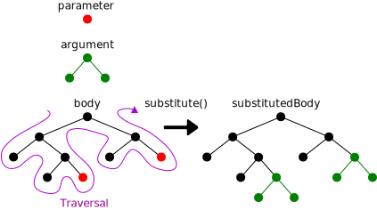
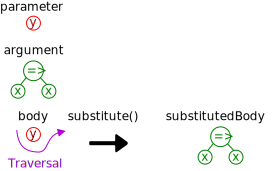
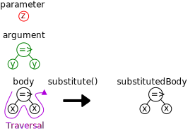
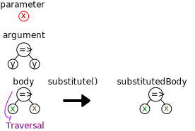

<!DOCTYPE html>
<html lang="en">
<head>
  <title>Yocto-CFA: A Program Analyzer That You Can Understand</title>
  <meta name="author" content="Leandro Facchinetti">
  <meta name="subject" content="TODO">
  <meta name="keywords" content="todo, todo, ...">
</head>
<body>
<header>
<div class="title-page">
  <div class="title">Yocto-CFA:<br>A Program Analyzer That You Can Understand</div>
  <div class="author">by<br>Leandro Facchinetti</div>
  <div class="statement">A dissertation submitted to Johns Hopkins University<br>in conformity with the requirements for the degree of Doctor of Philosophy</div>
  <div class="publishing-location">Baltimore, Maryland<br>August 2020</div>
</div>

<!-- TODO
# Abstract

- **Primary Reader and Advisor:** Dr. Scott Fraser Smith.
- **Readers:** Dr. Zachary Eli Palmer and Dr. Matthew Daniel Green.
-->

<!-- TODO: # Acknowledgements -->

<!-- TODO: # Dedication -->

# Table of Contents

</header>
<main>

<!-- TODO:

# Introduction

- Link to GitHub
-->

# Developing an Analyzer

<!-- TODO: An overview of the rest of the section -->

## The Analyzed Language: Yocto-JavaScript

Our first decision when developing a program analyzer is which language it should analyze. This decision is important, among other reasons, because it influences how difficult it is to develop the analyzer. In this dissertation we are interested in analysis techniques for higher-order functions, so we have plenty of options from which to choose, because higher-order functions are present in most languages, including JavaScript, Java, Python, Ruby, and so forth.

From all these options, we would like to choose JavaScript because it is the most popular programming language [stack-overflow-developer-survey, jet-brains-developer-survey](), but JavaScript has many features besides higher-order functions that would complicate our analyzer. As a compromise, we analyze some parts of JavaScript, but not the entire language: we analyze only the JavaScript features that are related to higher-order functions, a language subset which we call _Yocto-JavaScript_ (JavaScript`` math` \times ``10<sup>-24</sup>).

<fieldset>
<legend><strong>Advanced</strong></legend>

On the surface the choice of analyzed language is important because it influences how difficult it is to develop the analyzer, but it has deeper consequences as well: the analyzed language may also influence the analyzer’s precision and running time. For example, there is an analysis technique called `` math`k ``-CFA [k-cfa]() that may be slower when applied to a language with higher-order functions than when applied to a language with objects, because the algorithmic complexity of the former is exponential and of the latter is polynomial [m-cfa]().

</fieldset>

<fieldset>
<legend><strong>Technical Terms</strong></legend>

- **`` math`\lambda ``-Calculus [understanding-computation (§ 6)]():** Given the subset of JavaScript features that Yocto-JavaScript supports, it is a representation of the `` math`\lambda ``-calculus.

</fieldset>

### Values in Yocto-JavaScript

JavaScript has many kinds of values:

<figure>

| Kind of JavaScript Value |                Example                |
| :----------------------: | :-----------------------------------: |
|     `` js`String ``      |          `` js`"Leandro" ``           |
|     `` js`Number ``      |              `` js`29 ``              |
|      `` js`Array ``      |       `` js`["Leandro", 29] ``        |
|     `` js`Object ``      | `` js`{ name: "Leandro", age: 29 } `` |
|    `` js`Function ``     |            `` js`x => x ``            |
|            …             |                   …                   |

</figure>

From all these kinds of values, Yocto-JavaScript supports only one: `` js`Function ``. An Yocto-JavaScript function is written as `` js`<parameter> => <body> ``, for example, `` js`x => x ``, in which the `` js`<parameter> `` is called `` js`x `` and the `` js`<body> `` is a reference to the variable `` js`x `` (see [](#operations-in-yocto-javascript) for more on variable references). An Yocto-JavaScript function must have exactly one parameter. Because an Yocto-JavaScript function is a value, it may be passed as argument in a function call or returned as the result of a function call (see [](#operations-in-yocto-javascript) for more on function calls).

<fieldset>
<legend><strong>Technical Terms</strong></legend>

- **Arrow Function Expressions [javascript-arrow-function-expressions]():** The notation we use for writing functions.
- **Identity Function:** The function given as example, `` js`x => x ``.
- **High-Order Functions:** Functions that may act as values.

</fieldset>

### Operations in Yocto-JavaScript

JavaScript has many kinds of operations on the values introduced in [](#values-in-yocto-javascript):

<figure>

|      Kind of JavaScript Operation       |         Example         |    Result    |
| :-------------------------------------: | :---------------------: | :----------: |
| Access a character in a `` js`String `` |  `` js`"Leandro"[2] ``  | `` js`"a" `` |
|          Add `` js`Number ``s           |     `` js`29 + 1 ``     | `` js`30 ``  |
|        Call a `` js`Function ``         | `` js`parseInt("29") `` | `` js`29 ``  |
|                    …                    |            …            |      …       |

</figure>

From all these operations, Yocto-JavaScript supports only two: function calls and variable references. A function call is written as `` js`<function>(<argument>) ``, for example, `` js`f(a) ``, in which the `` js`<function> `` is a hypothetical function `` js`f `` and the `` js`<argument> `` is a hypothetical argument `` js`a ``. An Yocto-JavaScript function call must have exactly one argument (because an Yocto-JavaScript function must have exactly one parameter; see [](#values-in-yocto-javascript)). A variable reference is written as a bare identifier, for example, `` js`x ``.

The following is a complete Yocto-JavaScript program that exemplifies all the supported operations:

<figure>

| Example Yocto-JavaScript Program |      Result       |
| :------------------------------: | :---------------: |
|    `` js`(y => y)(x => x) ``     | `` js`(x => x) `` |

</figure>

This program is a function call in which the `` js`<function> `` is `` js`y => y `` and the `` js`<argument> `` is `` js`x => x ``. When called, an Yocto-JavaScript function returns the result of computing its `` js`<body> ``. The `` js`<body> `` of `` js`y => y `` is a reference to the variable `` js`y ``, so `` js`y => y `` is a function that returns its argument unchanged.

In general, all kinds of Yocto-JavaScript expressions (function definitions, function calls, and variable references) may appear in the `` js`<body> `` of a function definition, or as the `` js`<function> `` or `` js`<argument> `` of a call; for example, in the program `` js`(f(a))(b) `` the function call `` js`f(a) `` appears as the `` js`<function> `` of a call.

We use parentheses to resolve ambiguities on where function definitions start and end, and in which order operations are computed. For example, given hypothetical functions `` js`f ``, `` js`g ``, and `` js`h ``, in `` js`(f(g))(h) `` the call `` js`f(g) `` happens first and the result is a function that is called with `` js`h ``, and in `` js`f(g(h)) `` the call `` js`g(h) `` happens first and the result is passed as argument to `` js`f ``. If there are no parentheses, then nested function definitions are read right-to-left and a sequence of function calls are read left-to-right; for example, `` js`x => y => x `` is equivalent to `` js`x => (y => x) `` and `` js`f(a)(b) `` is equivalent to `` js`(f(a))(b) ``.

<fieldset>
<legend><strong>Technical Terms</strong></legend>

- **Precedence:** The order in which operations are computed. Operations that are computed first have _higher precedence_; operations that are computed later have _lower precedence_.
- **Associativity:** The order in which operations of the same type are computed. Function definitions are _right-associative_ and function calls are _left-associative_.

</fieldset>

<fieldset>
<legend><strong>Advanced</strong></legend>

### The Computational Power of Yocto-JavaScript

Yocto-JavaScript has only a few features, which makes it the ideal language for discussing the analysis of higher-order functions, but does it have enough features to support every kind of computation? Perhaps surprisingly, the answer is positive: Yocto-JavaScript is equivalent to JavaScript (and Java, Python, Ruby, and so forth) in the sense that any program in any one of these languages may be translated into an equivalent program in any other language [understanding-computation (§ 6)]().

As an example of how this translation could be done, consider a JavaScript function of two parameters: `` js`(x, y) => x ``. This function is not supported by Yocto-JavaScript because it does not have exactly one parameter (see [](#values-in-yocto-javascript)), but we may encode it as `` js`x => y => x ``, which is a function that receives the first parameter and returns another function that receives the second parameter. Similarly, we may encode a call with multiple arguments as a sequence of calls that passes one argument at a time; for example, `` js`f(a, b) `` may be encoded as `` js`f(a)(b) ``.

<fieldset>
<legend><strong>Technical Terms</strong></legend>

- **Computational Power:** The ability of expressing computations.
- **Turing Complete [understanding-computation (§ 7)]():** Property of a language that may express any computation of which a computer is capable. Yocto-JavaScript, JavaScript, Java, Python, Ruby, and so forth are all Turing Complete.
- **Currying [understanding-computation (page 163)]():** The translation technique we used to encode functions with multiple parameters and calls with multiple arguments.

</fieldset>

For our goal of exploring analysis techniques, we are concerned only with computational power, but it is worth noting that programmers would be more interested in other language properties: Does the language promote writing programs of higher quality? (It most probably does not [code-quality]().) Does the language improve productivity? Does the language work well in the domain of the problem? (For example, we would probably write an operating system in C and a web application in JavaScript, not the other way around.) Is the language more expressive than others? (Perhaps surprisingly, it is possible to make formal arguments about expressiveness without resorting to personal preference and anecdotal evidence [expressive-power]().) Despite having the same computational power as other languages, Yocto-JavaScript fares badly in these other aspects: it is remarkably unproductive and inexpressive.

### A Formal Grammar for Yocto-JavaScript

The description of Yocto-JavaScript given so far has been informal; the following is a grammar in *Backus–Naur Form* (BNF) [bnf, dragon-book (§ 4.2)]() that formalizes it:

<figure>

|              |     |                                                                                                                                  |             |
| -----------: | :-: | :------------------------------------------------------------------------------------------------------------------------------- | :---------- |
| `` math`e `` |  =  | `` js`( `` `` math`x ``  `` js`=> ``  `` math`e `` `` js`) `` \| `` math`e `` `` js`( `` `` math`e `` `` js`) `` \| `` math`x `` | Expressions |
| `` math`x `` |  =  | `<A JavaScript Identifier>`                                                                                                      | Variables   |

</figure>
</fieldset>

## The Analyzer Language: TypeScript

After choosing our analyzed language (Yocto-JavaScript; see [](#the-analyzed-language-yocto-javascript)), we must decide in which language to develop the analyzer itself. Our analyzed language is based on JavaScript, so it is a natural first candidate, but JavaScript lacks a feature which we will need: the ability to express the _types_ of data structures, functions, and so forth (see, for example, [](#data-structures-to-represent-yocto-javascript-programs)). We choose instead to implement our analyzer in a JavaScript extension with support for types called *TypeScript* [typescript-documentation, typescript-deep-dive, understanding-typescript]().

## Step 0: Substitution-Based Interpreter

Having chosen the analyzed language (Yocto-JavaScript; see [](#the-analyzed-language-yocto-javascript)) and the language in which to develop the analyzer itself (TypeScript; see [](#the-analyzer-language-typescript)), we are ready to start developing the analyzer. We begin in Step 0 by developing an interpreter that executes Yocto-JavaScript programs and produces the same outputs that would be produced by a regular JavaScript interpreter. This is a good starting point for two reasons: first, this interpreter is the basis upon which we will build the analyzer; and second, the outputs of this interpreter are the ground truth against which we will validate the outputs of the analyzer.

<!-- TODO: Forward reference to where we validate the outputs of the analyzer. -->

### Architecture

Our interpreter is defined as a function called `` ts`evaluate() ``, which receives an Yocto-JavaScript program represented as a string and returns the result of running it.

The following are two examples of how we will be able to use `` ts`evaluate() `` by the end of Step 0 (the `` ts`> `` represents the console, and by convention strings that represent Yocto-JavaScript programs are delimited by backticks (<code>ts``</code>) [javascript-template-literals]()):

```ts
> evaluate(`x => x`)
`x => x`
> evaluate(`(y => y)(x => x)`)
`x => x`
```

The implementation of `` ts`evaluate() `` is separated into three parts called `` ts`parse() ``, `` ts`run() ``, and `` ts`generate() ``:

<figure>


</figure>

```ts
export function evaluate(input: string): string {
  return generate(run(parse(input)));
}
```

The `` ts`parse() `` function prepares the `` ts`input `` for interpretation, converting it from a string into more convenient data structures (see [](#data-structures-to-represent-yocto-javascript-programs) for more on these data structures). The `` ts`run() `` function is responsible for the interpretation itself. The `` ts`generate() `` function converts the outputs of `` ts`run() `` into a human-readable format. In the following sections ([](#data-structures-to-represent-yocto-javascript-programs)–[](#an-operational-semantics-for-the-interpreter)) we address the implementation of `` ts`run() ``, deferring `` ts`parse() `` to [](#parser) and `` ts`generate() `` to [](#generator).

In later Steps the implementations of `` ts`run() `` and `` ts`generate() `` will change, but the implementations of `` ts`evaluate() `` and `` ts`parse() `` will remain the same, because the architecture and the data structures used to represent Yocto-JavaScript programs will remain the same.

<fieldset>
<legend><strong>Advanced</strong></legend>

The `` ts`evaluate() `` function is named after a native JavaScript function called `` ts`eval() `` [javascript-eval](), which is similar to `` ts`evaluate() `` but for JavaScript programs instead of Yocto-JavaScript. The `` ts`parse() `` and `` ts`generate() `` functions are named after the library functions used to implement them (see [](#parser) and [](#generator)).

</fieldset>

### Data Structures to Represent Yocto-JavaScript Programs

The `` ts`evaluate() `` function receives an Yocto-JavaScript program represented as a string (see [](#architecture)), which is convenient for humans to write and read, but inconvenient for `` ts`run() `` to manipulate directly, because it is concerned with the _structure_ rather than the _text_ of the program: for `` ts`run() `` it does not matter, for example, whether a function is written as `` js`x => x `` or `` js`x=>x ``. So before `` ts`run() `` starts interpreting the program, `` ts`parse() `` transforms it from a string into more convenient data structures (see [](#parser) for `` ts`parse() ``’s implementation).

The following are two examples of Yocto-JavaScript programs and the data structures used to represent them:

<table>
<tr>
<td>

```ts
> parse(`x => x`)
{
  "type": "ArrowFunctionExpression",
  "params": [
    {
      "type": "Identifier",
      "name": "x"
    }
  ],
  "body": {
    "type": "Identifier",
    "name": "x"
  }
}
```

</td>
<td align="center">


</td>
</tr>
<tr>
<td>

```ts
> parse(`(y => y)(x => x)`)
{
  "type": "CallExpression",
  "callee": {
    "type": "ArrowFunctionExpression",
    "params": [
      {
        "type": "Identifier",
        "name": "y"
      }
    ],
    "body": {
      "type": "Identifier",
      "name": "y"
    }
  },
  "arguments": [
    {
      "type": "ArrowFunctionExpression",
      "params": [
        {
          "type": "Identifier",
          "name": "x"
        }
      ],
      "body": {
        "type": "Identifier",
        "name": "x"
      }
    }
  ]
}
```

</td>
<td align="center">


</td>
</tr>
</table>

We choose to represent Yocto-JavaScript programs with the data structures above because they match the data structures used by Babel [babel](), which is a library to manipulate JavaScript programs that we use to implement the `` ts`parse() `` and `` ts`generate() `` functions (see [](#parser) and [](#generator)).

In general, the data structures used to represent Yocto-JavaScript programs have the following types (written as TypeScript types adapted from the Babel types [babel-types]() to include only the features supported by Yocto-JavaScript):

```ts
type Expression = ArrowFunctionExpression | CallExpression | Identifier;

type ArrowFunctionExpression = {
  type: "ArrowFunctionExpression";
  params: [Identifier];
  body: Expression;
};

type CallExpression = {
  type: "CallExpression";
  callee: Expression;
  arguments: [Expression];
};

type Identifier = {
  type: "Identifier";
  name: string;
};
```

In later Steps almost everything about the interpreter will change, but the data structures used to represent Yocto-JavaScript programs will remain the same.

<fieldset>
<legend><strong>Technical Terms</strong></legend>

- **Parsing [dragon-book (§ 4)]():** The process of converting a program represented as a string into more convenient data structures.
- **Abstract Syntax Tree (AST) [dragon-book (§ 4)]():** The data structures that represent a program.

</fieldset>

<fieldset>
<legend><strong>Advanced</strong></legend>

The definitions of the data structures used to represent programs correspond to elements of the Yocto-JavaScript grammar (see [](#a-formal-grammar-for-yocto-javascript)); for example, `` ts`Expression `` corresponds to `` math`e ``.

</fieldset>

### An Expression That Already Is a Value

<figure>

| Example Program | Current Output | Expected Output |
| :-------------: | :------------: | :-------------: |
| `` js`x => x `` |       —        | `` js`x => x `` |

</figure>

Having defined the architecture ([](#architecture)) and the data structures to represent Yocto-JavaScript programs ([](#data-structures-to-represent-yocto-javascript-programs)), we start developing the `` ts`run() `` function. The development is driven by a series of example programs that highlight different aspects of the interpreter. In [](#an-expression-that-already-is-a-value)–[](#a-reference-to-an-undefined-variable) we begin with these example programs and modify the implementation to achieve the expected output.

Consider the example program above. As mentioned in [](#data-structures-to-represent-yocto-javascript-programs), the `` ts`run() `` function receives as parameter an Yocto-JavaScript program represented as an `` ts`Expression ``. The `` ts`run() `` function is then responsible for interpreting the program and producing a value. In Yocto-JavaScript, the only kind of value is a function (see [](#values-in-yocto-javascript)), so we start the implementation of `` ts`run() `` with the following (we use `` ts`throw `` as a placeholder for code that has not be written yet to prevent the TypeScript compiler from signaling type errors):

```ts
type Value = ArrowFunctionExpression;

function run(expression: Expression): Value {
  throw new Error("NOT IMPLEMENTED YET");
}
```

The first thing that `` ts`run() `` has to do is determine which type of `` ts`expression `` it is given:

```ts{2-9}
function run(expression: Expression): Value {
  switch (expression.type) {
    case "ArrowFunctionExpression":
      throw new Error("NOT IMPLEMENTED YET");
    case "CallExpression":
      throw new Error("NOT IMPLEMENTED YET");
    case "Identifier":
      throw new Error("NOT IMPLEMENTED YET");
  }
}
```

In our current example, the `` ts`expression `` already is a `` ts`Value ``, so we return it unchanged:

```ts{3}
// run()
case "ArrowFunctionExpression":
  return expression;
```

### A Call Involving Immediate Functions

<figure>

|      Example Program      |    Current Output     | Expected Output |
| :-----------------------: | :-------------------: | :-------------: |
| `` js`(y => y)(x => x) `` | `NOT IMPLEMENTED YET` | `` js`x => x `` |

</figure>

Interpreting function calls is the main responsibility of our interpreter. There are several techniques to do this and in Step 0 we use one of the simplest: when the interpreter encounters a function call, it substitutes the variable references in the body of the called function with the argument. This is similar to how we reason about functions in mathematics; for example, given the function `` math`f(x) = x + 1 ``, we calculate `` math`f(29) `` by substituting the references to `` math`x `` in `` math`x + 1 `` with the argument `` math`29 ``: `` math`f(29) = 29 + 1 ``. The implementation of this substitution technique starts in this section and will only be complete in [](#substitution-in-function-calls).

In the example we are considering both the function that is called (`` js`y => y ``) and the argument (`` js`x => x ``) are immediate functions, as opposed to being the result of other operations, so for now we may limit the interpreter to handle only this case:

```ts{3-7}
// run()
case "CallExpression":
  if (
    expression.callee.type !== "ArrowFunctionExpression" ||
    expression.arguments[0].type !== "ArrowFunctionExpression"
  )
    throw new Error("NOT IMPLEMENTED YET");
  throw new Error("NOT IMPLEMENTED YET");
```

Next, we unpack the called function (using something called *destructuring assignment* [javascript-destructuring-assignment]()) and the argument:

```ts{8-12}
// run()
case "CallExpression":
  if (
    expression.callee.type !== "ArrowFunctionExpression" ||
    expression.arguments[0].type !== "ArrowFunctionExpression"
  )
    throw new Error("NOT IMPLEMENTED YET");
  const {
    params: [parameter],
    body,
  } = expression.callee;
  const argument = expression.arguments[0];
  throw new Error("NOT IMPLEMENTED YET");
```

Finally, we setup an auxiliary function called `` ts`substitute() `` that implements the traversal of the `` ts`body `` looking for references to `` ts`parameter `` and substituting them with the `` ts`argument `` (for now the result of substitution is restricted to be an `` ts`ArrowFunctionExpression ``):

<figure>



</figure>

```ts{13-19}
// run()
case "CallExpression":
  if (
    expression.callee.type !== "ArrowFunctionExpression" ||
    expression.arguments[0].type !== "ArrowFunctionExpression"
  )
    throw new Error("NOT IMPLEMENTED YET");
  const {
    params: [parameter],
    body,
  } = expression.callee;
  const argument = expression.arguments[0];
  const substitutedBody = substitute(body);
  if (substitutedBody.type !== "ArrowFunctionExpression")
    throw new Error("NOT IMPLEMENTED YET");
  return substitutedBody;
  function substitute(expression: Expression): Expression {
    throw new Error("NOT IMPLEMENTED YET");
  }
```

Similar to `` ts`run() `` itself, `` ts`substitute() `` starts by determining which type of `` ts`expression `` is passed to it:

```ts{2-9}
function substitute(expression: Expression): Expression {
  switch (expression.type) {
    case "ArrowFunctionExpression":
      throw new Error("NOT IMPLEMENTED YET");
    case "CallExpression":
      throw new Error("NOT IMPLEMENTED YET");
    case "Identifier":
      throw new Error("NOT IMPLEMENTED YET");
  }
}
```

In our current example the `` ts`expression `` is `` ts`y ``, an `` ts`Identifier ``, and it must be substituted with the `` ts`argument `` (`` js`x => x ``):

<figure>



</figure>

```ts{3}
// substitute()
case "Identifier":
  return argument;
```

### Substitution in Function Definitions

<figure>

|        Example Program         |    Current Output     |   Expected Output    |
| :----------------------------: | :-------------------: | :------------------: |
| `` js`(y => z => y)(x => x) `` | `NOT IMPLEMENTED YET` | `` js`z => x => x `` |

</figure>

When `` ts`substitute() `` (see [](#a-call-involving-immediate-functions)) starts traversing the `` ts`body `` of the example above, the `` ts`expression `` is an `` ts`ArrowFunctionExpression `` (`` js`z => y ``), and we want substitution to proceed deeper to find and substitute `` js`y ``, so we call `` ts`substitute() `` recursively (we use a feature called *spread syntax* [javascript-spread-syntax]() to build an `` ts`expression `` based on the existing one with a new `` ts`body ``):

<figure>


</figure>

```ts{3-6}
// substitute()
case "ArrowFunctionExpression":
  return {
    ...expression,
    body: substitute(expression.body),
  };
```

### Name Mismatch

<figure>

|        Example Program         |     Current Output     | Expected Output |
| :----------------------------: | :--------------------: | :-------------: |
| `` js`(z => x => x)(y => y) `` | `` js`x => (y => y) `` | `` js`x => x `` |

</figure>

The implementation of `` ts`substitute() `` in the case of `` ts`Identifier `` introduced in [](#a-call-involving-immediate-functions) _always_ substitutes variable references, regardless of whether they refer to the `` ts`parameter `` of the called function. For example, in the program above `` ts`substitute() `` is substituting the `` js`x `` even though the `` ts`parameter `` is `` js`z ``. To fix this, we check whether the variable reference matches the `` ts`parameter ``, and if it does not then we prevent the substitution by retuning the variable reference unchanged:

<figure>



</figure>

```ts{3}
// substitute()
case "Identifier":
  if (expression.name !== parameter.name) return expression;
  return argument;
```

### Name Reuse

<figure>

|                                                                                                                                                                                                                                                                                                                                 Example Program                                                                                                                                                                                                                                                                                                                                 |                                                                                                                                                                                              Current Output                                                                                                                                                                                              |                                                                                              Expected Output                                                                                               |
| :-----------------------------------------------------------------------------------------------------------------------------------------------------------------------------------------------------------------------------------------------------------------------------------------------------------------------------------------------------------------------------------------------------------------------------------------------------------------------------------------------------------------------------------------------------------------------------------------------------------------------------------------------------------------------------: | :------------------------------------------------------------------------------------------------------------------------------------------------------------------------------------------------------------------------------------------------------------------------------------------------------------------------------------------------------------------------------------------------------: | :--------------------------------------------------------------------------------------------------------------------------------------------------------------------------------------------------------: |
| <code><span style="color: #000000">(</span><span style="color: #FF0000">x</span><span style="color: #000000"> </span><span style="color: #0000FF">=&gt;</span><span style="color: #000000"> </span><span style="color: #008000">x</span><span style="color: #000000"> </span><span style="color: #0000FF">=&gt;</span><span style="color: #000000"> </span><span style="color: #795E26">x</span><span style="color: #000000">)(</span><span style="color: #001080">y</span><span style="color: #000000"> </span><span style="color: #0000FF">=&gt;</span><span style="color: #000000"> </span><span style="color: #001080">y</span><span style="color: #000000">)</span></code> | <code><span style="color: #008000">x</span><span style="color: #000000"> </span><span style="color: #0000FF">=&gt;</span><span style="color: #000000"> (</span><span style="color: #001080">y</span><span style="color: #000000"> </span><span style="color: #0000FF">=&gt;</span><span style="color: #000000"> </span><span style="color: #001080">y</span><span style="color: #000000">)</span></code> | <code><span style="color: #008000">x</span><span style="color: #000000"> </span><span style="color: #0000FF">=&gt;</span><span style="color: #000000"> </span><span style="color: #795E26">x</span></code> |

<!--
| `` js`(x => x => x)(y => y) `` | `` js`x => (y => y) `` | `` js`x => x `` |
<code><span style="color: #FF0000">x</span></code>
<code><span style="color: #008000">x</span></code>
<code><span style="color: #795E26">x</span></code>
-->

</figure>

In the program above, <code><span style="color: #795E26">x</span></code> may refer to either <code><span style="color: #FF0000">x</span></code> or <code><span style="color: #008000">x</span></code>:

<figure>

|              | If <code><span style="color: #795E26">x</span></code> Refers to |                                                                                                                                                                                  Then the Output of Example Program Is                                                                                                                                                                                   |
| :----------: | :-------------------------------------------------------------: | :------------------------------------------------------------------------------------------------------------------------------------------------------------------------------------------------------------------------------------------------------------------------------------------------------------------------------------------------------------------------------------------------------: |
| **Option 1** |       <code><span style="color: #FF0000">x</span></code>        | <code><span style="color: #008000">x</span><span style="color: #000000"> </span><span style="color: #0000FF">=&gt;</span><span style="color: #000000"> (</span><span style="color: #001080">y</span><span style="color: #000000"> </span><span style="color: #0000FF">=&gt;</span><span style="color: #000000"> </span><span style="color: #001080">y</span><span style="color: #000000">)</span></code> |
| **Option 2** |       <code><span style="color: #008000">x</span></code>        |                                                                                                <code><span style="color: #008000">x</span><span style="color: #000000"> </span><span style="color: #0000FF">=&gt;</span><span style="color: #000000"> </span><span style="color: #795E26">x</span></code>                                                                                                |

</figure>

Currently `` ts`substitute() `` is implementing Option 1, but this leads to an issue: we are unable to reason about <code><span style="color: #008000">x</span><span style="color: #000000"> </span><span style="color: #0000FF">=&gt;</span><span style="color: #000000"> </span><span style="color: #795E26">x</span></code> independently; we must know where it appears and whether a variable called <code><span style="color: #FF0000">x</span></code> is already defined there.

We avoid this issue by modifying `` ts`substitute() `` to implement Option 2, which is also the choice of JavaScript and every other popular programming language. We change `` ts`substitute() ``’s behavior when encountering a function definition so that if the parameter of the function definition matches the parameter that `` ts`subsitute() `` is looking for, then `` ts`subsitute() `` returns the function unchanged, preventing further substitution (there is no recursive call to `` ts`substitute() `` in this case):

<figure>



</figure>

```ts{3}
// substitute()
case "ArrowFunctionExpression":
  if (expression.params[0].name === parameter.name) return expression;
  return {
    ...expression,
    body: substitute(expression.body),
  };
```

<fieldset>
<legend><strong>Technical Terms</strong></legend>

- **Local Reasoning:** The ability to reason about a function without having to know the context under which it appears. Option 1 defeats local reasoning and Option 2 enables it.
- **Shadowing:** The behavior exhibited by Option 2: <code><span style="color: #FF0000">x</span></code> is _shadowed_ by <code><span style="color: #008000">x</span></code> because there is no way to refer to <code><span style="color: #FF0000">x</span></code> from the body of the inner function.

</fieldset>

### Substitution in Function Calls

<figure>

|                     |                                   |
| ------------------: | :-------------------------------- |
| **Example Program** | `` js`(y => z => y(y))(x => x) `` |
|  **Current Output** | `NOT IMPLEMENTED YET`             |
| **Expected Output** | `` js`z => (x => x)(x => x) ``    |

</figure>

This case is similar to [](#substitution-in-function-definitions): all `` ts`substitute() `` has to do is continue traversing the function call recursively:

<figure>


</figure>

```ts{3-7}
// substitute()
case "CallExpression":
  return {
    ...expression,
    callee: substitute(expression.callee),
    arguments: [substitute(expression.arguments[0])],
  };
```

This concludes the implementation of `` ts`substitute() ``.

### An Argument That Is Not Immediate

<figure>

|                     |                                          |
| ------------------: | :--------------------------------------- |
| **Example Program** | `` js`(a => z => a)((y => y)(x => x)) `` |
|  **Current Output** | `NOT IMPLEMENTED YET`                    |
| **Expected Output** | `` js`z => x => x ``                     |

</figure>

In all example programs we considered so far the `` js`argument `` is an `` ts`ArrowFunctionExpression ``, but in general it may be any kind of `` ts`Expression ``; for example, in the program above it is a `` ts`CallExpression ``. We address the general case by calling `` ts`run() `` recursively on the `` js`argument `` to evaluate it to a `` ts`Value ``:

```ts{9}
// run()
case "CallExpression":
  if (expression.callee.type !== "ArrowFunctionExpression")
    throw new Error("NOT IMPLEMENTED YET");
  const {
    params: [parameter],
    body,
  } = expression.callee;
  const argument = run(expression.arguments[0]);
  const substitutedBody = substitute(body);
  if (substitutedBody.type !== "ArrowFunctionExpression")
    throw new Error("NOT IMPLEMENTED YET");
  return substitutedBody;
  function substitute(expression: Expression): Expression {
    // ...
  }
```

<fieldset>
<legend><strong>Technical Terms</strong></legend>

- **Big-Step Interpreter [operational-semantics]():** The technique of calling `` ts`run() `` recursively to evaluate the `` js`argument ``.

</fieldset>

<fieldset>
<legend><strong>Advanced</strong></legend>

The notion that the argument is interpreted to produce a value as soon as the function call is encountered characterizes Yocto-JavaScript as a _call-by-value_ language [call-by-name-call-by-value-and-the-lambda-calculus](). JavaScript itself and most other popular programming languages are call-by-value as well, but there is a notable exception, Haskell, which is a _call-by-need_ language. In a call-by-need language the argument is interpreted only if it is _needed_, for example, if it is used in the function position of another call (see § \ref{A Function That Is Not Immediate}), or if it is the result of the program (see § \ref{Continuing to Run After a Function Call}). In a call-by-need language the result of the program above would be `` js`z => ((a => a)(y => y)) ``. And there is yet another policy for when to interpret arguments called _call-by-name_: the difference between call-by-name and call-by-need is that in a call-by-name language the an argument may be computed multiple times if it is used multiple times, but in a call-by-need language an argument is guaranteed to be computed at most once.

</fieldset>

### A Function That Is Not Immediate

\begin{center}
\begin{tabular}{ll}
\textbf{Example Program} & `` js`((z => z)(x => x))(y => y) `` \\
\textbf{Current Output} & `` text`NOT IMPLEMENTED YET `` \\
\textbf{Expected Output} & `` js`y => y `` \\
\end{tabular}
\end{center}

This is the dual of § \ref{An Argument That Is Not Immediate} for the called function, and the solution is the same: to call `` ts`run() `` recursively (we also remove the check of whether the function is immediate):

```ts{6}
// run()
case "CallExpression":
  const {
    params: [parameter],
    body,
  } = run(expression.callee);
  const argument = run(expression.arguments[0]);
  const substitutedBody = substitute(body);
  if (substitutedBody.type !== "ArrowFunctionExpression")
    throw new Error("NOT IMPLEMENTED YET");
  return substitutedBody;
  function substitute(expression: Expression): Expression {
    // ...
  }
```

### Continuing to Run After a Function Call

\begin{center}
\begin{tabular}{ll}
\textbf{Example Program} & `` js`(x => (z => z)(x))(y => y) `` \\
\textbf{Current Output} & `` text`NOT IMPLEMENTED YET `` \\
\textbf{Expected Output} & `` js`y => y `` \\
\end{tabular}
\end{center}

This is similar to § \ref{An Argument That Is Not Immediate} and § \ref{A Function That Is Not Immediate}: the result of substitution may be not an immediate function but another call, and more work may be necessary to interpret it. We solve this with yet another recursive call to `` ts`evaluate() `` (we also remove yet another check and inline the `` ts`substitutedBody `` variable):

```ts{8}
// run()
case "CallExpression":
  const {
    params: [parameter],
    body,
  } = run(expression.callee);
  const argument = run(expression.arguments[0]);
  return run(substitute(body));
  function substitute(expression: Expression): Expression {
    // ...
  }
```

### A Reference to an Undefined Variable

\begin{center}
\begin{tabular}{ll}
\textbf{Example Program} & `` js`(x => y)(y => y) `` \\
\textbf{Current Output} & `` text`NOT IMPLEMENTED YET `` \\
\textbf{Expected Output} & `` text`Reference to undefined variable: y `` \\
\end{tabular}
\end{center}

The only case in which `` ts`run() `` may encounter a variable reference directly is if the referenced variable is undefined, otherwise `` ts`substitute() `` would have already substituted it (see [](#a-call-involving-immediate-functions)–§ \ref{Continuing to Run After a Function Call}). In this case, we throw an exception:

```ts{3}
// run()
case "Identifier":
  throw new Error(`Reference to undefined variable: ${expression.name}`);
```

\begin{center}
\begin{tabular}{ll}
\textbf{Example Program} & `` js`x => y `` \\
\textbf{Current Output} & `` js`x => y `` \\
\textbf{Expected Output} & `` js`x => y `` \\
\end{tabular}
\end{center}

If the reference to an undefined variable occurs in the body of a function that is not called, then we do not reach the case addressed in this section and an exception is not thrown. This is consistent with JavaScript’s behavior.

### The Entire Runner

The implementation of the `` ts`run() `` function is complete:

```ts{number}
type Value = ArrowFunctionExpression;

function run(expression: Expression): Value {
  switch (expression.type) {
    case "ArrowFunctionExpression":
      return expression;
    case "CallExpression":
      const {
        params: [parameter],
        body,
      } = run(expression.callee);
      const argument = run(expression.arguments[0]);
      return run(substitute(body));
      function substitute(expression: Expression): Expression {
        switch (expression.type) {
          case "ArrowFunctionExpression":
            if (expression.params[0].name === parameter.name) return expression;
            return {
              ...expression,
              body: substitute(expression.body),
            };
          case "CallExpression":
            return {
              ...expression,
              callee: substitute(expression.callee),
              arguments: [substitute(expression.arguments[0])],
            };
          case "Identifier":
            if (expression.name !== parameter.name) return expression;
            return argument;
        }
      }
    case "Identifier":
      throw new Error(`Reference to undefined variable: ${expression.name}`);
  }
}
```

<fieldset>
<legend><strong>Advanced</strong></legend>

### An Operational Semantics for the Interpreter

What we accomplished so far in this section is more than defining an interpreter for Yocto-JavaScript; we also defined formally the _meaning_ of Yocto-JavaScript programs: an Yocto-JavaScript program means what the interpreter produces for it. The definition of the meaning of programs in a language is something called the _semantics_ of the language, and there are several techniques to specify semantics; the one we are using so far is known as a *definitional interpreter* [definitional-interpreters]().

A definitional interpreter has some advantages over other techniques for specifying semantics: it is easier to understand for most programmers, and it is executable. But a definitional interpreter also has one disadvantage: to understand the meaning of an Yocto-JavaScript program we have to understand an interpreter written in TypeScript. To address this, there are other techniques for defining semantics that do not depend on other programming languages, and in this section we introduce one of them: *operational semantics* [operational-semantics, semantics-engineering, pl-book]().

First, we extend the grammar from [](#a-formal-grammar-for-yocto-javascript) with the notion of values that is equivalent to the type `` ts`Value `` (see § \ref{Step 0: The Entire Runner}, line 1):

\begin{center}
\begin{tabular}{rcll}
`` math`v `` & ::= & `` math`x `` js`=>`e` & Values \\
\end{tabular}
\end{center}

Next, we define a _relation_ `` math`e \Rightarrow v `` using _inference rules_ that are equivalent to the behavior of `` ts`run() `` (see § \ref{Step 0: The Entire Runner}, lines 3–36):

\begin{mathpar}
\inferrule
{ }
{v \Rightarrow v}

\inferrule
{
e*{f} \Rightarrow x*{p}`` js` => ``e*{b} \\
e*{a} \Rightarrow v*{a} \\
e*{b}[x*{p} \backslash v*{a}] \Rightarrow v \\
}
{e*{f}`` js`( ``e*{a}`` js`) `` \Rightarrow v}
\end{mathpar}

Finally, we define a _metafunction_ `` math`e[x \backslash v] = e `` that is equivalent to the behavior of `` ts`substitute() `` (see § \ref{Step 0: The Entire Runner}, lines 14–32):

\begin{center}
\begin{tabular}{rcll}
`` math`(x `` js` => ``e)[x_{p} \backslash v_{a}] `` & = & `` math `x`` js` => ``(e[x*{p} \backslash v*{a}]) `& if` math` x \neq x_{p} `` \\ `` math `(x*{p}`` js` => ``e)[x*{p} \backslash v*{a}] `& = &` math`x*{p}`` js` => ``e `& \\` math` (e_{f} `` js `( `e_{a}` js` ) ``)[x_{p} \backslash v_{a}] `` & = & `` math `(e*{f}[x*{p} \backslash v*{a}])`` js`( ``(e*{a}[x*{p} \backslash v*{a}])`` js`) `` `& \\` math` x[x_{p} \backslash v_{a}] `` & = & `` math `x `& if` math` x \neq x_{p} `` \\ `` math `x*{p}[x*{p} \backslash v*{a}] `& = &` math`v*{a} `` & \\
\end{tabular}
\end{center}

</fieldset>

### Parser

The parser is responsible for converting an Yocto-JavaScript program written as a string into data structures that are more convenient for the runner to manipulate (see [](#architecture) for a high-level view of the architecture and [](#data-structures-to-represent-yocto-javascript-programs) for the definition of the data structures). We choose to represent Yocto-JavaScript programs with data structures that are compatible with a specification for representing JavaScript programs called ESTree [estree, estree-types]() because it allows us to use tools from the JavaScript ecosystem, including a parser called Esprima [esprima](), and the Esprima Interactive Online Demonstration [esprima-demonstration](), which shows the data structures used to represent a given program.

Our strategy to implement the Yocto-JavaScript parser is to delegate most of the work to Esprima and check that the program is using only features supported by Yocto-JavaScript. The following is the full implementation of the parser:

```ts{number}
function parse(input: string): Expression {
  const program = esprima.parseScript(input, { range: true }, checkFeatures);
  const expression = (program as any).body[0].expression as Expression;
  return expression;
  function checkFeatures(node: estree.Node): void {
    switch (node.type) {
      case "Program":
        if (node.body.length !== 1)
          throw new Error(
            "Unsupported Yocto-JavaScript feature: Program with multiple statements"
          );
        break;
      case "ExpressionStatement":
        break;
      case "ArrowFunctionExpression":
        break;
      case "CallExpression":
        if (node.arguments.length !== 1)
          throw new Error(
            "Unsupported Yocto-JavaScript feature: CallExpression with multiple arguments"
          );
        break;
      case "Identifier":
        break;
      default:
        throw new Error(`Unsupported Yocto-JavaScript feature: ${node.type}`);
    }
  }
}
```

\begin{description}
\item [Line 1:]

The parser is defined as a function called `` ts`parse() ``, which receives the program `` ts`input `` represented as a `` ts`string `` and returns an `` ts`Expression `` (see [](#data-structures-to-represent-yocto-javascript-programs)).

\item [Line 2:]

Call `` ts`esprima.parseScript() ``, which parses the `` ts`input `` as a JavaScript program and produces a data structure following the ESTree specification. The `` ts`esprima.parseScript() `` function also detects syntax errors, for example, in the program `` js`x => ``, which is missing the function body.

The `` ts`{ range: true ``} argument causes Esprima to include in the generated data structures some information about the part of the `` ts`input `` from where they came. We do not use this information (it is not even part of the definition of the data structures; see [](#data-structures-to-represent-yocto-javascript-programs)), but in programs with expressions that repeat, for example, `` ts`x => x => x ``, this information distinguishes the `` ts`x ``s.

We pass as argument to `` ts`esprima.parseScript() `` a function called `` ts`checkFeatures() `` which is called with every fragment of data structure that represents a part of the program. The purpose of `` ts`checkFeatures() `` is to check that the program uses only the features that are supported by Yocto-JavaScript.

\item [Line 3:]

Extract the single `` ts`Expression `` from within the `` ts`Program `` returned by `` ts`esprima.parseScript() ``. The `` ts`as <something> `` forms sidestep the TypeScript type checker and assert that the `` ts`expression `` is of the correct type. This is safe to do because of `` ts`checkFeatures() ``.

\item [Line 5:]

The `` ts`checkFeatures() `` function, which is passed to `` ts`esprima.parseScript() `` is called with every fragment of data structure used to represent the program. These fragments are called _nodes_, because the data structure as a whole forms a _tree_, also known as the *Abstract Syntax Tree* (AST) of the program (see [](#data-structures-to-represent-yocto-javascript-programs)). The `` ts`checkFeatures() `` does not return anything (`` ts`void ``); its purpose is only to throw an exception in case the program uses a feature that is not supported by Yocto-JavaScript.

\item [Lines 6, 7, 13, 15, 17, 23, 25:]

Similar to `` ts`run() `` and `` ts`substitute() `` (see § \ref{Step 0: The Entire Runner}), `` ts`checkFeatures() `` starts by determining which type of `` ts`estree.Node `` it is given.

\item [Lines 8–11:]

Check that the `` ts`Program `` contains a single statement. This prevents programs such as `` js`x => x; y => y ``.

\item [Lines 13, 15:]

`` ts`ExpressionStatement ``s and `` ts`ArrowFunctionExpression ``s are supported in Yocto-JavaScript unconditionally. We could check that the `` ts`ArrowFunctionExpression `` includes only one parameter and that this parameter is a variable (as opposed to being a pattern such as `` js`[x, y] ``, for example), but this would be redundant because Esprima already calls `` ts`checkFeatures() `` with other unsupported `` ts`node ``s that subsume these cases. For example, given the program `` js`(x, y) => x ``, which is a function of multiple parameters, Esprima calls `` ts`checkFeatures() `` with a `` ts`node `` of type `` ts`SequenceExpression ``. Similarly, given the program `` js`([x, y]) => x ``, which is a function in which the parameter is a pattern, Esprima calls `` ts`checkFeatures() `` with a `` ts`node `` of type `` ts`ArrayExpression ``.

\item [Lines 18–21:]

Check that the `` ts`CallExpression `` contains a single argument. This prevents programs such as `` js`f(a, b) ``.

\item [Line 23:]

`` ts`Identifier ``s are supported in Yocto-JavaScript unconditionally. An `` ts`Identifier `` may be an expression or the parameter of an `` ts`ArrowFunctionExpression ``.

\item [Line 26:]

All other types of `` ts`estree.Node `` are not supported by Yocto-JavaScript. This includes programs such as `` js`29 `` (`` ts`estree.Literal ``) and `` js`const f = x => x `` (`` ts`estree.VariableDeclarator ``).
\end{description}

In later Steps almost everything about the interpreter will change, but the parser will remain the same.

### Generator

The generator transforms a `` ts`Value `` produced by `` ts`run() `` into a human-readable format (see [](#architecture) for a high-level view of the architecture). Similar to what happened in the parser (see [](#parser)), we may implement the generator by reusing existing tools from the JavaScript ecosystem, because we are representing Yocto-JavaScript programs and values with data structures that follow the ESTree specification. In particular, we use a library called Escodegen [escodegen]() to generate a string representation of an ESTree data structure, and a library called Prettier [prettier]() to format that string. The following is the full implementation of the generator:

```ts{number}
function generate(value: Value): string {
  return prettier
    .format(escodegen.generate(value), {
      parser: "babel",
      semi: false,
      arrowParens: "avoid",
    })
    .trim();
}
```

\begin{description}
\item [Line 4:]

Prettier needs to parse and regenerate the string representing the value, in an architecture similar to that of the interpreter (see [](#architecture)), and it may use different parsers. We choose Babel [babel](), which is the default parser for JavaScript (Prettier also supports formatting other languages, for example, TypeScript and Markdown).

\item [Line 5:]

Instruct Prettier not to produce semicolons at the end of the line, for example, `` js`x => y `` instead of `` js`x => y; ``.

\item [Line 6:]

Instruct Prettier not to wrap parameters in parentheses, for example, `` js`x => y `` instead of `` js`(x) => y ``.

\item [Line 8:]

Remove the newline at the end of the output produced by Prettier.
\end{description}

### Programs That Do Not Terminate

\begin{center}
\begin{tabular}{ll}
\textbf{Example Program} & `` js`(f => f(f))(f => f(f)) `` \\
\textbf{Current Output} & `` text`DOES NOT TERMINATE `` \\
\textbf{Expected Output} & `` text`DOES NOT TERMINATE `` \\
\end{tabular}
\end{center}

<fieldset>
<legend><strong>Technical Terms</strong></legend>

This example program is also known as the _`` math`\Omega ``-combinator_. The function `` js`f => f(f) `` that is part of this program is also known as the _`` math`U ``-combinator_ (`` math`\Omega = (U)(U) ``).

</fieldset>

Yocto-JavaScript may express any program that a computer may run (see § \ref{The Computational Power of Yocto-JavaScript}), including some programs that do not terminate. For example, consider the program above, which is the shortest non-terminating program in Yocto-JavaScript. The following is a trace of the first call to `` ts`run() ``:

\begin{center}
\begin{tabular}{rrcl}
\textbf{Line} & \multicolumn{1}{l}{(see § \ref{Step 0: The Entire Runner})} & & \\
3 & `` ts`expression `` & = & `` js`(f => f(f))(f => f(f)) `` \\
9 & `` ts`parameter `` & = & `` js`f `` \\
10 & `` ts`body `` & = & `` js`f(f) `` \\
12 & `` ts`argument `` & = & `` js`f => f(f) `` \\
13 & `` ts`substitute(body) `` & = & `` js`(f => f(f))(f => f(f)) `` \\
\end{tabular}
\end{center}

The result of substitution is the same as the initial expression, so when it is passed as argument to the recursive call to `` ts`run() `` in line 13, it causes `` ts`run() `` to go into an infinite loop.

\begin{center}
\begin{tabular}{ll}
\textbf{Example Program} & `` js`(f => (f(f))(f(f)))(f => (f(f))(f(f))) `` \\
\textbf{Current Output} & `` text`DOES NOT TERMINATE `` \\
\textbf{Expected Output} & `` text`DOES NOT TERMINATE `` \\
\end{tabular}
\end{center}

There are also programs for which interpretation does not terminate that never produce the same expression twice. For example, consider the program above, which is a variation of the first program in which every variable reference to `` js`f `` has been replaced with `` js`f(f) ``. The following is a trace of the first call to `` ts`run() ``:

\begin{center}
\begin{tabular}{rrcl}
\textbf{Line} & \multicolumn{1}{l}{(see § \ref{Step 0: The Entire Runner})} & & where `` js`F = f => (f(f))(f(f)) `` \\
3 & `` ts`expression `` & = & `` js`F(F) `` \\
9 & `` ts`parameter `` & = & `` js`f `` \\
10 & `` ts`body `` & = & `` js`(f(f))(f(f)) `` \\
12 & `` ts`argument `` & = & `` js`F `` \\
13 & `` ts`substitute(body) `` & = & `` js`(F(F))(F(F)) `` \\
\end{tabular}
\end{center}

The result of substitution (`` js`(F(F))(F(F)) ``) is an expression that contains the initial expression (the first `` js`F(F) ``) in addition to some extra work (the second `` js`F(F) ``), so when it is passed as argument to the recursive call to `` ts`run() `` in line 13, it causes `` ts`run() `` to go into an infinite loop. Unlike what happened in the first example, when interpreting this program the expressions that are passed to `` ts`run() `` never repeat themselves:

\begin{center}
\begin{tabular}{l}
`` js`(F(F)) `` \\
`` js`(F(F))(F(F)) `` \\
`` js`(F(F))(F(F))(F(F)) `` \\
`` js`(F(F))(F(F))(F(F))(F(F)) `` \\
\multicolumn{1}{c}{`` math`\vdots ``} \\
\end{tabular}
\end{center}

Non-termination is what we expect from an interpreter, but not from an analyzer, and as the second example demonstrates, preventing non-termination is not as simple as checking whether `` ts`run() `` is being called with the same expression multiple times. As we move forward from an interpreter to an analyzer in the next Steps one of the main issues we address is termination: even if it takes a long time, an analyzer must eventually finish its work regardless of the program it is given.

<fieldset>
<legend><strong>Advanced</strong></legend>

Detecting non-termination in an interpreter without losing any information about the original program is a problem that cannot be solved, regardless of the sophistication of the detector and the computational power available to it. The problem, which is known as the _halting problem_, is said to be *uncomputable* [understanding-computation (§ 8)](), and is a direct consequence of the Turing completeness of Yocto-JavaScript (see § \ref{The Computational Power of Yocto-JavaScript}). In our analyzer we will guarantee termination by allowing some information to be lost.

</fieldset>

## Step 1: Environment-Based Interpreter

The interpreter in Step 0 may not terminate for some programs, and preventing non-termination is one of the main issues we must address when developing an analyzer (see § \ref{Step 0: Programs That Do Not Terminate}). The source of non-termination in Step 0 is substitution, which may produce infinitely many new expressions and cause the interpreter to loop forever. In Step 1, we modify the interpreter so that it does not perform substitution, and as a consequence it considers only the finitely many expressions found in the input program. The interpreter in Step 1 may still not terminate, but that is due to other sources of non-termination that will be addressed in subsequent Steps.

### Avoiding Substitution by Introducing Environments and Closures

When the interpreter from Step 0 encounters a function call, it produces a new expression by traversing the body of the called function and substituting the references to the parameter with the argument, for example:

\begin{center}
\begin{tabular}{ll}
\textbf{Example Program} (see [](#substitution-in-function-definitions)) & `` js`(x => z => x)(y => y) `` \\
\textbf{Step 0 Output} & `` js`z => (y => y) `` \\
\end{tabular}
\end{center}

The issue with this strategy is that the expression `` js`z => (y => y) `` does not exist in the original program, and as mentioned in § \ref{Step 0: Programs That Do Not Terminate}, there is a possibility that the interpreter tries to produce infinitely many of these new expressions and loops forever. In Step 1 we want to avoid producing new expressions, so that the interpreter has to consider only the finitely many expressions found in the original program. We accomplish this by interpreting function calls with a different strategy: instead of performing substitution, we maintain a map from variables to the values with which they would have been substituted, for example:

\begin{center}
\begin{tabular}{ll}
\textbf{Example Program} & `` js`y => y `` \\
\textbf{Step 1 Output} & `` math`\langle `` js` (y => y) ``, [] \rangle `` \\ \textbf{Example Program} & `` js `(x => z => x)(y => y) `\\ \textbf{Step 1 Output} &` math` \langle `` js `(z => x) `, [` js` x `` \mapsto \langle `` js `(y => y) `, [] \rangle] \rangle` \\
\end{tabular}
\end{center}

<fieldset>
<legend><strong>Technical Terms</strong></legend>

A map from variables to the values with which they would have been replaced (for example, `` math`[ `` js` x `` \mapsto \langle `` js `(y => y) `, [] \rangle]`) is something called an _environment_. A function along with an environment (for example, `` math`\langle `` js` (z => x) ``, [ `` js `x `\mapsto \langle` js`(y => y)`, [] \rangle] \rangle`) is something called a *closure* [closures]().

</fieldset>

In Step 1 we have a different notion of _value_: while in Step 0 the interpreter produced a _function_, now it produces a _closure_. It is possible to use the closure produced in Step 1 to recreate the function that would have been produced in Step 0 by substituting the variable references in the function body with the corresponding values from the environment found in the closure. We may do this to check that the outputs of the interpreters are equivalent, but in Step 1 we do not perform substitution in the regular course of interpretation; we add more mappings to the environment and look up variable references in the environment.

<fieldset>
<legend><strong>Alternative Argument</strong></legend>

Another way to reason about an environment-based interpreter is that it is a substitution-based interpreter in which substitutions are delayed until they are needed.

</fieldset>

### New Data Structures

The following are the data structures used to represent environments and closures:

```ts
type Value = Closure;

type Closure = {
  function: ArrowFunctionExpression;
  environment: Environment;
};

type Environment = MapDeepEqual<Identifier["name"], Value>;
```

<fieldset>
<legend><strong>Implementation Details</strong></legend>

The `` ts`MapDeepEqual `` data structure is provided by a JavaScript package developed by the author called Collections Deep Equal [collections-deep-equal](). A `` ts`MapDeepEqual `` is similar to a `` ts`Map ``, except that the keys are compared by value, not by reference, for example:

```ts
> new Map([[{ age: 29 }, "Leandro"]]).get({ age: 29 });
undefined
> new MapDeepEqual([[{ age: 29 }, "Leandro"]]).get({ age: 29 });
"Leandro"
```

The occurrences of `` ts`{ age: 29 ``} are objects with the same key and value, but they are not the same object.

</fieldset>

### Adding an Environment to the Runner

The runner needs to maintain an environment, so we modify the implementation of `` ts`run() `` from § \ref{Step 0: The Entire Runner} to introduce an auxiliary function called `` ts`step() `` that receives an `` ts`environment `` as an extra parameter:

```ts{number}{2-3,11-13}
function run(expression: Expression): Value {
  return step(expression, new MapDeepEqual());
  function step(expression: Expression, environment: Environment): Value {
    switch (expression.type) {
      case "ArrowFunctionExpression":
        return expression;
      case "CallExpression":
        const {
          params: [parameter],
          body,
        } = step(expression.callee, environment);
        const argument = step(expression.arguments[0], environment);
        return step(substitute(body), environment);
        function substitute(expression: Expression): Expression {
          switch (expression.type) {
            case "ArrowFunctionExpression":
              if (expression.params[0].name === parameter.name)
                return expression;
              return {
                ...expression,
                body: substitute(expression.body),
              };
            case "CallExpression":
              return {
                ...expression,
                callee: substitute(expression.callee),
                arguments: [substitute(expression.arguments[0])],
              };
            case "Identifier":
              if (expression.name !== parameter.name) return expression;
              return argument;
          }
        }
      case "Identifier":
        throw new Error(`Reference to undefined variable: ${expression.name}`);
    }
  }
}
```

\begin{description}
\item [Line 3:]

We define the `` ts`step() `` auxiliary function that receives an `` ts`environment `` as an extra parameter.

\item [Line 2:]

The `` ts`environment `` starts empty.

\item [Lines 11–13:]

The recursive calls to `` ts`run() `` are changed to recursive calls to `` ts`step() `` and the `` ts`environment `` is propagated.
\end{description}

The listing above does not compile yet because we are not producing closures. In the following sections we fix this by considering how to manage the `` ts`environment `` for each type of `` ts`expression ``.

### A Function Definition

\begin{center}
\begin{tabular}{ll}
\textbf{Example Program} & `` js`x => x `` \\
\textbf{Current Output} & — \\
\textbf{Expected Output} & `` math`\langle `` js`(x => x)`, [] \rangle` \\
\end{tabular}
\end{center}

When the interpreter encounters a function definition, it captures the current `` ts`environment `` in a closure:

```ts
// step()
case "ArrowFunctionExpression":
  return { function: expression, environment };
```

### A Function Call

\begin{center}
\begin{tabular}{ll}
\textbf{Example Program} & `` js`(x => z => x)(y => y) `` \\
\textbf{Current Output} & — \\
\textbf{Expected Output} & `` math`\langle `` js` (z => x) ``, [ `` js `x `\mapsto \langle` js`(y => y)`, [] \rangle] \rangle` \\
\end{tabular}
\end{center}

First, we remove `` ts`substitute() ``, which is the goal of Step 1:

```ts{8}
// step()
case "CallExpression":
  const {
    params: [parameter],
    body,
  } = step(expression.callee, environment);
  const argument = step(expression.arguments[0], environment);
  return step(body, environment);
```

Next, we fix the pattern that matches the result of the interpretation of the called function to take in account the closure:

```ts{4,7,8}
// step()
case "CallExpression":
  const {
    function: {
      params: [parameter],
      body,
    },
    environment: functionEnvironment,
  } = step(expression.callee, environment);
  const argument = step(expression.arguments[0], environment);
  return step(body, environment);
```

Finally, we modify the recursive call to `` ts`step() `` that interprets the function body so that it receives a new augmented `` ts`environment `` including a mapping from the `` ts`parameter `` (for example, `` js`x ``) to the `` ts`argument `` (for example, `` math`\langle `` js`(y => y)`, [] \rangle`):

```ts{number}{11-14}
// step()
case "CallExpression":
  const {
    function: {
      params: [parameter],
      body,
    },
    environment: functionEnvironment,
  } = step(expression.callee, environment);
  const argument = step(expression.arguments[0], environment);
  return step(
    body,
    new MapDeepEqual(environment).set(parameter.name, argument)
  );
```

### Name Reuse

\begin{center}
\begin{tabular}{ll}
\textbf{Example Program} & `` js`(x => x => z => x)(a => a)(y => y) `` \\
\textbf{Current Output} & `` math`\langle `` js` (z => x) ``, [ `` js `x `\mapsto \langle` js` (y => y) ``, [] \rangle] \rangle `` \\ \textbf{Expected Output} & `` math `\langle `` js`(z => x) ``, [`` js`x `` \mapsto \langle `` js`(y => y) ``, [] \rangle] \rangle `` \\
\end{tabular}
\end{center}

If a name is reused (for example, `` js`x `` in the example program above), then the second time it is encountered by `` ts`step() `` it is overwritten in the `` ts`environment `` (see the call to `` ts`set() `` in line 13 of § \ref{A Function Call}, which overwrites an existing map key). This causes the variable reference to `` js`x `` to refer to the second (inner) `` ts`x ``, which is the expected behavior (it is what we called Option 2 in § \ref{Step 0: Name Reuse}).

### A Variable Reference

\begin{center}
\begin{tabular}{ll}
\textbf{Example Program} & `` js`(y => y)(x => x) `` \\
\textbf{Current Output} & — \\
\textbf{Expected Output} & `` math`\langle `` js` (y => y) ``, [] \rangle `` \\ \\ \textbf{Example Program} & `` js `(x => y)(y => y) `\\ \textbf{Current Output} & — \\ \textbf{Expected Output} &` text` Reference to undefined variable: y `` \\ \\ \textbf{Example Program} & `` js `x => y `\\ \textbf{Current Output} & — \\ \textbf{Expected Output} &` math` \langle `` js `(x => y) `, [] \rangle` \\
\end{tabular}
\end{center}

When we encounter a variable reference, we look it up in the current environment:

```ts{3-8}
// step()
case "Identifier":
  const value = environment.get(expression.name);
  if (value === undefined)
    throw new Error(
      `Reference to undefined variable: ${expression.name}`
    );
  return value;
```

### A Function Body Is Evaluated with the Environment in Its Closure

\begin{center}
\begin{tabular}{ll}
\textbf{Example Program} & \\
\multicolumn{2}{l}{`` js`(f => (x => f(x))(a => a))((x => z => x)(y => y)) ``} \\
\textbf{Current Output} & `` math`\langle `` js` (a => a) ``, [ `` js `f `\mapsto \langle` js` (z => x) ``, [ `` js `x `\mapsto \langle` js` (y => y) ``, [] \rangle ] \rangle] \rangle `` \\ \textbf{Expected Output} & `` math `\langle `` js`(y => y) ``, [] \rangle `` \\
\end{tabular}
\end{center}

This example program shows the difference between the current environment with which an expression is evaluated and the environment that comes from a closure. The following is a trace of the first call to `` ts`step() ``, when a closure is created:

\begin{center}
\begin{tabular}{rrcl}
\multicolumn{4}{c}{\textbf{Trace 1: First Call to `` ts`step() `` · Closure Creation}} \\
\textbf{Line} & \multicolumn{1}{l}{(see § \ref{A Function Call})} & & \\
& `` ts`expression.callee `` & = & `` js`f => (x => f(x))(a => a) `` \\
& `` ts`expression.arguments[0] `` & = & `` js`(x => z => x)(y => y) `` \\
\rowcolor[rgb]{.88,1,1} 10 & `` ts`argument `` & = & `` math`\langle `` js` (z => x) ``, [ `` js `x `\mapsto \langle` js`(y => y)`, [] \rangle] \rangle` \\
\end{tabular}
\end{center}

And the following is a trace of the recursive call to `` ts`step() `` in which that closure is called:

\begin{center}
\begin{tabular}{rrcl}
\multicolumn{4}{c}{\textbf{Trace 2: Recursive Call to `` ts`step() `` · Closure Call}} \\
\textbf{Line} & \multicolumn{1}{l}{(see § \ref{A Function Call})} & & \\
& `` ts`expression `` & = & `` js`f(x) `` \\
& `` ts`expression.callee `` & = & `` js`f `` \\
\rowcolor[rgb]{.88,1,1} & `` ts`expression.arguments[0] `` & = & `` js`x `` \\
\rowcolor[rgb]{.88,1,1} & `` ts`environment `` & = & `` math`[ `` js` x `` \mapsto \langle `` js `(a => a) `, [\cdots] \rangle, \cdots]` \\
9 & `` math` `` ts` step( ``\cdots `` ts `) `& = &` math` \langle `` js ` (z => x) `, [` js `x`\mapsto \langle`js` (y => y) `, [] \rangle] \rangle` \\ 5 & `` ts `parameter `& = &` js` z `` \\ \rowcolor[rgb]{.88,1,1} 6 & `` ts `body `& = &` js` x `` \\ \rowcolor[rgb]{.88,1,1} 8 & `` ts `functionEnvironment `& = &` math` [ `` js `x`\mapsto \langle`js`(y => y) `, [] \rangle]` \\
\multicolumn{4}{c}{Paused before line 10}\\
\end{tabular}
\end{center}

At this point, there are two expressions left to evaluate: the argument (`` ts`expression.arguments[0] ``; line 10), and the body of the called function (`` ts`body ``; lines 11–14). Both of these expressions have the same code (`` js`x ``), and our current implementation looks up this variable both times on the current `` ts`environment ``, which produces the same value: `` math`\langle `` js`(a => a)`, [\cdots] \rangle`.

But this leads to an issue: we may not reason about `` js`z => x `` by looking only at where it is defined; we must also examine all the places in which it may be called. This is the same issue we had to solve when considering name reuse in Step 0 (see § \ref{Step 0: Name Reuse}). We would like, instead, for each `` js`x `` to refer to the value that existed in the environment where the closure is _created_, not where it is _called_:

\begin{center}
\includegraphics[page = 8]{images.pdf}
\end{center}

To implement this, we change the recursive call to `` ts`step() `` that evaluates the function body so that it uses the environment coming from the closure (`` js`functionEnvironment ``) instead of the current environment (`` js`environment ``):

```ts{13}
// step()
case "CallExpression":
  const {
    function: {
      params: [parameter],
      body,
    },
    environment: functionEnvironment,
  } = step(expression.callee, environment);
  const argument = step(expression.arguments[0], environment);
  return step(
    body,
    new MapDeepEqual(functionEnvironment).set(parameter.name, argument)
  );
```

<fieldset>
<legend><strong>Technical Terms</strong></legend>

The principle of being able to reason about a function only by looking at its definition is something called _local reasoning_ (see § \ref{Step 0: Name Reuse}). The treatment given to the environment before this section is something called _dynamic scoping_, because the _scope_ of a variable (where a variable is defined) is _dynamic_, depending on where the function is called. The treatment given to the environment in this section is something called _static scoping_ or _lexical scoping_, because the scope of a variable is determined before we start interpreting the program.

</fieldset>

<fieldset>
<legend><strong>Advanced</strong></legend>

There are languages that implement dynamic scoping. In some cases dynamic scoping is the only option, for example, in the original implementation of LISP [lisp-original](), though that was later considered a mistake [lisp-history](). In some cases dynamic scoping is the default, but there is an option to use static scoping, for example, in Emacs Lisp [emacs-lisp (§ 12.10)](). In some cases dynamic scoping is an extra feature to be used sparingly, for example, in Racket’s `` clojure`parameterize `` [racket-guide (§ 4.13)]().

</fieldset>

### The Entire Runner

We completed the changes necessary to transform the `` ts`run() `` function from the substitution-based interpreter in Step 0 into an environment-based interpreter:

```ts{number}
type Value = Closure;

type Closure = {
  function: ArrowFunctionExpression;
  environment: Environment;
};

type Environment = MapDeepEqual<Identifier["name"], Value>;

function run(expression: Expression): Value {
  return step(expression, new MapDeepEqual());
  function step(expression: Expression, environment: Environment): Value {
    switch (expression.type) {
      case "ArrowFunctionExpression":
        return { function: expression, environment };
      case "CallExpression":
        const {
          function: {
            params: [parameter],
            body,
          },
          environment: functionEnvironment,
        } = step(expression.callee, environment);
        const argument = step(expression.arguments[0], environment);
        return step(
          body,
          new MapDeepEqual(functionEnvironment).set(parameter.name, argument)
        );
      case "Identifier":
        const value = environment.get(expression.name);
        if (value === undefined)
          throw new Error(
            `Reference to undefined variable: ${expression.name}`
          );
        return value;
    }
  }
}
```

<fieldset>
<legend><strong>Advanced</strong></legend>

### Operational Semantics

We adapt the operational semantics from [](#an-operational-semantics-for-the-interpreter) to the interpreter defined in Step 1. First, we change the notion of values:

\begin{center}
\begin{tabular}{rcll}
`` math`v `` & = & `` math`\langle `` js` ( ``x `` js ` => `e` js` ) ``, \rho \rangle `` & Values / Closures \\ `` math `\rho `& = &` math`\{x \mapsto v, \cdots\} `` & Environments \\
\end{tabular}
\end{center}

We then define the relation `` math`\rho \vdash e \Rightarrow v `` to be equivalent to the new implementation of `` ts`run() ``:

\begin{mathpar}
\inferrule
{ }
{\rho \vdash `` js`( ``x`` js` => ``e`` js`) `` \Rightarrow \langle `` js`( ``x`` js` => ``e`` js`) ``, \rho \rangle}

\inferrule
{
\rho \vdash e_f \Rightarrow \langle `` js`( ``x`` js` => ``e_b`` js`) ``, \rho_f \rangle \\
\rho \vdash e_a \Rightarrow v_a \\
\rho_f \cup \{x \mapsto v_a\} \vdash e_b \Rightarrow v \\
}
{\rho \vdash e_f`` js`( ``e_a`` js`) `` \Rightarrow v}

\inferrule
{ }
{\rho \vdash x \Rightarrow \rho(x)}
\end{mathpar}

</fieldset>

### Generator

We modify the generator from [](#generator) to support closures. For example, the following is the representation of the closure from § \ref{A Function Call}:

\begin{center}
`` math`\langle `` js` (z => x) ``, [ `` js `x `\mapsto \langle` js`(y => y)`, [] \rangle] \rangle`
\end{center}

```js
{
  "function": "z => x",
  "environment": [
    [
      "x",
      {
        "function": "y => y",
        "environment": []
      }
    ]
  ]
}
```

The following is the modified implementation of `` ts`generate() ``:

```ts{number}{1,2,4,5,15}
function generate(value: any): string {
  return JSON.stringify(
    value,
    (key, value) => {
      if (value.type !== undefined)
        return prettier
          .format(escodegen.generate(value), {
            parser: "babel",
            semi: false,
            arrowParens: "avoid",
          })
          .trim();
      return value;
    },
    2
  );
}
```

\begin{description}
\item [Line 1:]

Change the input type from `` ts`Value `` to `` ts`any ``, because this implementation of `` ts`strinfigy() `` supports any data structure, including the data structures we will define in later Steps.

\item [Line 2:]

Call `` ts`JSON.stringify() `` [javascript-json-stringify](), which traverses any data structure and converts it into a string.

\item [Line 4:]

Provide a `` ts`replacer `` that is responsible for converting data structures that represent Yocto-JavaScript programs into strings.

\item [Line 5:]

Check whether a data structure represents an Yocto-JavaScript program by checking the existence of a field called `` ts`type `` (see [](#data-structures-to-represent-yocto-javascript-programs)), in which case we use the previous implementation of `` ts`generate() `` (see [](#generator)) to produce a string.

\item [Line 15:]

Format the output with indentation of two spaces.
\end{description}

This implementation of `` ts`generate() `` supports not only closures but any data structure (because of `` ts`JSON.stringify() ``), so it will remain the same in the following Steps.

### Programs That Do Not Terminate

The programs that do not terminate in Step 0 (see § \ref{Step 0: Programs That Do Not Terminate}) do not terminate in Step 1 either, because the interpreters are equivalent except for the technique used to interpret function calls, but the sources of non-termination are different. In Step 0 substitution may produce infinitely many expressions, including expressions that do not occur in the original program. In Step 1 the interpreter considers only the finitely many expressions that occur in the original program, but it may produce infinitely many environments.

This difference is significant because there are programs that produce infinitely many different expressions in Step 0, but produce the same expression and environment repeatedly in Step 1, and in these cases we could detect non-termination by checking whether the runner is in a loop with the same arguments, for example:

\begin{center}
\begin{tabular}{ll}
\multicolumn{2}{c}{`` js`(F(F)) ``, where `` js`F = f => (f(f))(f(f)) ``} \\
\multicolumn{1}{c}{\textbf{Step 0}} & \multicolumn{1}{c}{\textbf{Step 1}} \\
`` js`(F(F)) `` & `` math`\langle `` js` (F(F)) ``, [ `` js `f `\mapsto \langle` js` F ``, [] \rangle] \rangle `` \\ `` js `(F(F))(F(F)) `&` math` \langle `` js `(F(F)) `, [` js` f `` \mapsto \langle `` js `F `, [] \rangle] \rangle` \\
`` js`(F(F))(F(F))(F(F)) `` & `` math`\langle `` js` (F(F)) ``, [ `` js `f `\mapsto \langle` js` F ``, [] \rangle] \rangle `` \\ `` js `(F(F))(F(F))(F(F))(F(F)) `&` math` \langle `` js `(F(F)) `, [` js` f `` \mapsto \langle `` js `F `, [] \rangle] \rangle` \\
\multicolumn{1}{c}{`` math`\vdots ``} & \multicolumn{1}{c}{`` math`\vdots ``} \\
\end{tabular}
\end{center}

But this strategy is insufficient to guarantee termination, because there are programs that do not terminate which produce infinitely many different environments, for example:

\begin{center}
\begin{tabular}{l}
\multicolumn{1}{c}{`` js`(f => c => f(f)(x => c))(f => c => f(f)(x => c))(y => y) ``} \\
\multicolumn{1}{c}{or `` js`F(F)(y => y) ``, where `` js`F = f => c => f(f)(C) `` and `` js`C = x => c ``} \\
`` math`\langle `` js` f(f)(C) ``, [ `` js `c `\mapsto \langle` js` (y => y) ``, [] \rangle, \cdots] \rangle `` \\ `` math `\langle `` js`f(f)(C) ``, [`` js`c `` \mapsto \langle `` js`C ``, [`` js`c `` \mapsto \langle `` js`(y => y) ``, [] \rangle, \cdots] \rangle, \cdots] \rangle `\\` math` \langle `` js `f(f)(C) `, [` js` c `` \mapsto \langle `` js `C `, [` js` c `` \mapsto \langle `` js `C `, [` js` c `` \mapsto \langle `` js `(y => y) `, [] \rangle, \cdots] \rangle, \cdots] \rangle, \cdots] \rangle` \\
`` math`\langle `` js` f(f)(C) ``, [ `` js `c `\mapsto \langle` js` C ``, [ `` js `c `\mapsto \langle` js` C ``, [ `` js `c `\mapsto \langle` js` C ``, [ `` js `c `\mapsto \langle` js` (y => y) ``, [] \rangle, \cdots] \rangle, \cdots] \rangle, \cdots] \rangle, \cdots] \rangle `` \\ \multicolumn{1}{c}{`` math `\vdots ``} \\
\end{tabular}
\end{center}

The program above is a variation on the shortest non-terminating program, `` js`(f => f(f))(f => f(f)) ``, in which each `` js`f => f(f) `` receives an additional parameter `` js`c ``, and each `` js`f(f) `` receives an additional argument `` js`x => c ``.

The interpreter in Step 1 may produce infinitely many different environments because environments may be nested. That is the issue that we address in Step 2.

<fieldset>
<legend><strong>Technical Terms</strong></legend>

The nesting of environments in Step 1 characterizes them as something called _recursive data structures_: data structures that may contain themselves. The data structures used to represented Yocto-JavaScript programs are recursive as well (see [](#data-structures-to-represent-yocto-javascript-programs)).

</fieldset>

## Step 2: Store-Based Interpreter

The source of non-termination in Step 1 is the nesting of the environments (see § \ref{Step 1: Programs That Do Not Terminate}). In Step 2, we address this issue by introducing a layer of indirection between a name in the environment and its corresponding value. The interpreter in Step 2 may still not terminate, but that is due to other sources of non-termination that will be addressed in subsequent Steps.

### Avoiding Nested Environments by Introducing a Store

In Step 1 a closure contains an environment mapping names to other closures, which in turn contain their own environments mapping to yet more closures. In Step 2, we remove this circularity by introducing a layer of indirection: an environment maps names to _addresses_, which may be used to lookup values in a _store_, for example:

\begin{center}
\begin{tabular}{rcc}
(See § \ref{A Variable Reference}) & \textbf{Step 1} & \textbf{Step 2} \\
\textbf{Variable Reference} & `` js`x `` & `` js`x `` \\
\textbf{Environment} & `` math`[ `` js` x `` \mapsto \langle `` js `(y => y) `, [] \rangle]` & `` math`[ `` js` x `` \mapsto `` js `0 `]` \\
\textbf{Store} & — & `` math`[ `` js` 0 `` \mapsto \langle `` js `(y => y) `, [] \rangle]` \\
\textbf{Value} & `` math`\langle `` js` (y => y) ``, [] \rangle `` & `` math `\langle `` js`(y => y) ``, [] \rangle `` \\
\end{tabular}
\end{center}

Each closure continues to include its own environment, because it needs to look up variable references from where the closure was created (see § \ref{A Function Body Is Evaluated with the Environment in Its Closure}), but there is only one store for the entire interpreter, and we avoid ambiguities by allocating different addresses, for example:

\begin{center}
\begin{tabular}{rll}
(See § \ref{A Function Body Is Evaluated with the Environment in Its Closure}) & \multicolumn{1}{c}{\textbf{Step 1}} & \multicolumn{1}{c}{\textbf{Step 2}} \\
`` ts`environment `` & `` math`[ `` js` x `` \mapsto \langle `` js `(a => a) `, [\cdots] \rangle, \cdots]` & `` math`[ `` js` x `` \mapsto `` js `0 `, \cdots]` \\
`` ts`funcEnv. `` & `` math`[ `` js` x `` \mapsto \langle `` js `(y => y) `, [] \rangle]` & `` math`[ `` js` x `` \mapsto `` js `1 `]` \\
\textbf{Store} & \multicolumn{1}{c}{—} & `` math`[ `` js` 0 `` \mapsto \langle `` js `(a => a) `, [\cdots] \rangle,` \\
& & `` math`\phantom{[} `` js` 1 `` \mapsto \langle `` js `(y => y) `, [] \rangle]`
\end{tabular}
\end{center}

The runner must return the store along with the value, for the variable references to be looked up, for example:

\begin{center}
\begin{tabular}{ll}
\textbf{Example Program} (see § \ref{A Function Call}) & `` js`(x => z => x)(y => y) `` \\
\textbf{Step 1 Output} & `` math`\langle `` js` (z => x) ``, [ `` js `x `\mapsto \langle` js` (y => y) ``, [] \rangle] \rangle `` \\ \textbf{Step 2 Output} & `` ts `value `=` math` \langle `` js `(z => x) `, [` js` x `` \mapsto `` js `0 `] \rangle` \\
& `` ts`store `` = `` math`[ `` js` 0 `` \mapsto \langle `` js `(y => y) `, [] \rangle]` \\
\end{tabular}
\end{center}

<fieldset>
<legend><strong>Advanced</strong></legend>

The technique used in Step 2 is related to the run-time environments that are the target of traditional compilers for languages such as C [dragon-book (§ 7)](): an environment corresponds to some of the data stored in an activation frame on the call stack, and the store corresponds to the heap.

</fieldset>

### New Data Structures

The following are the data structures used to represent environments, stores, and addresses:

```ts
type Environment = MapDeepEqual<Identifier["name"], Address>;

type Store = MapDeepEqual<Address, Value>;

type Address = number;
```

### Adding a Store to the Runner

We modify the implementation of `` ts`run() `` from § \ref{Step 1: The Entire Runner} to introduce a `` ts`store ``:

```ts{number}
function run(expression: Expression): { value: Value; store: Store } {
  const store: Store = new MapDeepEqual();
  return { value: step(expression, new MapDeepEqual()), store };
  function step(expression: Expression, environment: Environment): Value {
    // ...
  }
}
```

\begin{description}
\item [Lines 1 and 3:]

The `` ts`store `` is returned because it is necessary to look up variable references in the `` ts`value ``.

\item [Lines 2 and 4:]

The `` ts`store `` is unique for the whole interpreter, unlike `` ts`environment ``s which are different for each closure, so we create only one store that is always available to `` ts`step() `` instead of adding it as an extra parameter.
\end{description}

### Adding a Value to the Store

\begin{center}
\begin{tabular}{ll}
\textbf{Example Program} & `` js`(x => z => x)(y => y) `` \\
\textbf{Current Output} & — \\
\textbf{Expected Output} & `` ts`value `` = `` math`\langle `` js` (z => x) ``, [ `` js `x `\mapsto` js` 0 ``] \rangle `` \\ & `` ts `store `=` math` [ `` js `0 `\mapsto \langle` js`(y => y)`, [] \rangle]` \\
\end{tabular}
\end{center}

In Step 1, when we encounter a function call we extend the `` ts`functionEnvironment `` with a mapping from the `` ts`parameter.name `` to the `` ts`argument `` (see § \ref{A Function Call}, \ref{A Function Body Is Evaluated with the Environment in Its Closure}). In Step 2, we introduce the `` ts`store `` as a layer of indirection:

```ts{number}{11,12,15}
// step()
case "CallExpression": {
  const {
    function: {
      params: [parameter],
      body,
    },
    environment: functionEnvironment,
  } = step(expression.callee, environment);
  const argument = step(expression.arguments[0], environment);
  const address = store.size;
  store.set(address, argument);
  return step(
    body,
    new MapDeepEqual(functionEnvironment).set(parameter.name, address)
  );
}
```

\begin{description}
\item [Line 11:]

Allocate an `` ts`address ``. We use the `` ts`store.size `` as the `` ts`address `` because as the `` ts`store `` grows this number changes, so it is guaranteed to be unique throughout the interpretation of a program.

\item [Line 15:]

Extend the `` ts`functionEnvironment `` with a mapping from the `` ts`parameter.name `` to the `` ts`address ``.

\item [Line 12:]

Extend the `` ts`store `` with a mapping from the `` ts`address `` to the `` ts`argument ``. This is mutating the unique `` ts`store `` that is available to the entire `` ts`step() `` function, not creating a new `` ts`store `` in the same way that extending an `` ts`environment `` creates a new `` ts`environment `` (see line 15).
\end{description}

### Retrieving a Value from the Store

\begin{center}
\begin{tabular}{ll}
\textbf{Example Program} & `` js`(y => y)(x => x) `` \\
\textbf{Current Output} & — \\
\textbf{Expected Output} & `` ts`value `` = `` math`\langle `` js` (y => y) ``, [] \rangle `` \\ & `` ts `store `=` math` [ `` js `0 `\mapsto \langle` js`(y => y)`, [] \rangle]` \\
\end{tabular}
\end{center}

In Step 1 we retrieved values directly from the `` ts`environment `` (see § \ref{A Variable Reference}), but in Step 2 we have to go through the `` ts`store ``:

```ts{number}{3,8}
// step()
case "Identifier": {
  const address = environment.get(expression.name);
  if (address === undefined)
    throw new Error(
      `Reference to undefined variable: ${expression.name}`
    );
  return store.get(address)!;
}
```

\begin{description}
\item [Line 3:]

Retrieve the `` ts`address `` from the `` ts`environment ``.

\item [Line 8:]

Retrieve the `` ts`value `` from the `` ts`store `` at the given `` ts`address `` found in the `` ts`environment ``. The `` ts`address `` is guaranteed to be in the `` ts`store `` because we extend the `` ts`store `` and the `` ts`environment `` together (see § \ref{Adding a Value to the Store}), so we use `` ts`! `` to indicate that `` ts`get() `` may not return `` ts`undefined ``.
\end{description}

### The Entire Runner

We completed the changes necessary to remove the circularity between closures and environments:

```ts{number}
type Environment = MapDeepEqual<Identifier["name"], Address>;

type Store = MapDeepEqual<Address, Value>;

type Address = number;

function run(expression: Expression): { value: Value; store: Store } {
  const store: Store = new MapDeepEqual();
  return { value: step(expression, new MapDeepEqual()), store };
  function step(expression: Expression, environment: Environment): Value {
    switch (expression.type) {
      case "ArrowFunctionExpression": {
        return { function: expression, environment };
      }
      case "CallExpression": {
        const {
          function: {
            params: [parameter],
            body,
          },
          environment: functionEnvironment,
        } = step(expression.callee, environment);
        const argument = step(expression.arguments[0], environment);
        const address = store.size;
        store.set(address, argument);
        return step(
          body,
          new MapDeepEqual(functionEnvironment).set(parameter.name, address)
        );
      }
      case "Identifier": {
        const address = environment.get(expression.name);
        if (address === undefined)
          throw new Error(
            `Reference to undefined variable: ${expression.name}`
          );
        return store.get(address)!;
      }
    }
  }
}
```

<fieldset>
<legend><strong>Advanced</strong></legend>

### Operational Semantics

We adapt the operational semantics from § \ref{Step 2: Operational Semantics} to the interpreter defined in Step 2. First, we change the notion of environments:

\begin{center}
\begin{tabular}{rcll}
`` math`\rho `` & = & `` math`\{x \mapsto A, \cdots\} `` & Environments \\
`` math`\sigma `` & = & `` math`\{A \mapsto v, \cdots\} `` & Stores \\
`` math`A `` & = & `` math`\mathbb{N} `` & Addresses \\
\end{tabular}
\end{center}

We then define the relation `` math`\rho, \sigma \vdash e \Rightarrow \langle v, \sigma \rangle `` to be equivalent to the new implementation of `` ts`run() ``:

\begin{mathpar}
\inferrule
{ }
{\rho, \sigma \vdash `` js`( ``x`` js` => ``e`` js`) `` \Rightarrow \langle \langle `` js`( ``x`` js` => ``e`` js`) ``, \rho \rangle, \sigma \rangle}

\inferrule
{
\rho, \sigma \vdash e_f \Rightarrow \langle \langle `` js`( ``x`` js` => ``e_b`` js`) ``, \rho_f \rangle, \sigma_f \rangle \\
\rho, \sigma_f \vdash e_a \Rightarrow \langle v_a, \sigma_a \rangle \\
A = \lvert \sigma_a \rvert \\
\rho_f \cup \{x \mapsto A\}, \sigma_a \cup \{A \mapsto v_a\} \vdash e_b \Rightarrow \langle v, \sigma_v \rangle \\
}
{\rho, \sigma \vdash e_f`` js`( ``e_a`` js`) `` \Rightarrow \langle v, \sigma_v \rangle}

\inferrule
{ }
{\rho, \sigma \vdash x \Rightarrow \sigma(\rho(x))}
\end{mathpar}

</fieldset>

### Programs That Do Not Terminate

The programs that do not terminate in Step 1 (see § \ref{Step 1: Programs That Do Not Terminate}) do not terminate in Step 2 either, because the interpreters are equivalent except for the treatment of environments, but the sources of non-termination are different. In both cases the issue is that the interpreter may create infinitely many environments, but in Step 1 the environments are nested, and in Step 2 they contain different addresses, for example:

\begin{center}
\begin{tabular}{l}
\multicolumn{1}{c}{`` js`(f => c => f(f)(x => c))(f => c => f(f)(x => c))(y => y) ``} \\
\multicolumn{1}{c}{or `` js`F(F)(y => y) ``, where `` js`F = f => c => f(f)(C) `` and `` js`C = x => c ``} \\
\multicolumn{1}{c}{\textbf{Step 1}} \\
`` math`\langle `` js` f(f)(C) ``, [ `` js `c `\mapsto \langle` js` (y => y) ``, [] \rangle, \cdots] \rangle `` \\ `` math `\langle `` js`f(f)(C) ``, [`` js`c `` \mapsto \langle `` js`C ``, [`` js`c `` \mapsto \langle `` js`(y => y) ``, [] \rangle, \cdots] \rangle, \cdots] \rangle `\\` math` \langle `` js `f(f)(C) `, [` js` c `` \mapsto \langle `` js `C `, [` js` c `` \mapsto \langle `` js `C `, [` js` c `` \mapsto \langle `` js `(y => y) `, [] \rangle, \cdots] \rangle, \cdots] \rangle, \cdots] \rangle` \\
`` math`\langle `` js` f(f)(C) ``, [ `` js `c `\mapsto \langle` js` C ``, [ `` js `c `\mapsto \langle` js` C ``, [ `` js `c `\mapsto \langle` js` C ``, [ `` js `c `\mapsto \langle` js` (y => y) ``, [] \rangle, \cdots] \rangle, \cdots] \rangle, \cdots] \rangle, \cdots] \rangle `` \\ \multicolumn{1}{c}{`` math `\vdots `} \\ \multicolumn{1}{c}{\textbf{Step 2}} \\ \multicolumn{1}{c}{` math` \langle `` js `f(f)(C) `, [` js` c `` \mapsto `` js `0 `, \cdots] \rangle`} \\
\multicolumn{1}{c}{`` math`\langle `` js` f(f)(C) ``, [ `` js `c `\mapsto` js` 1 ``, \cdots] \rangle ``} \\ \multicolumn{1}{c}{`` math `\langle `` js`f(f)(C) ``, [`` js`c `` \mapsto `` js`2 ``, \cdots] \rangle `} \\ \multicolumn{1}{c}{` math` \langle `` js `f(f)(C) `, [` js` c `` \mapsto `` js `3 `, \cdots] \rangle`} \\
\multicolumn{1}{c}{`` math`\vdots ``} \\
\multicolumn{1}{c}{`` math`[ `` js` 0 `` \mapsto \langle `` js `(y => y) `, [] \rangle,` js` 1 `` \mapsto \langle `` js `C `, [` js` c `` \mapsto `` c `0 `, \cdots] \rangle,` js` 2 `` \mapsto \langle `` js `C `, [` js` c `` \mapsto `` c `1 `, \cdots] \rangle, \cdots]`}
\end{tabular}
\end{center}

We address this issue in Step 3.

## Step 3: Finitely Many Addresses

### The Entire Runner

We completed the changes necessary to produce only finitely many addresses:

```ts{number}
type Value = SetDeepEqual<Closure>;

type Address = Identifier;

function run(expression: Expression): { value: Value; store: Store } {
  const store: Store = new MapDeepEqual();
  return { value: step(expression, new MapDeepEqual()), store };
  function step(expression: Expression, environment: Environment): Value {
    switch (expression.type) {
      case "ArrowFunctionExpression": {
        return new SetDeepEqual([{ function: expression, environment }]);
      }
      case "CallExpression": {
        const value: Value = new SetDeepEqual();
        for (const {
          function: {
            params: [parameter],
            body,
          },
          environment: functionEnvironment,
        } of step(expression.callee, environment)) {
          const argument = step(expression.arguments[0], environment);
          const address = parameter;
          store.merge(new MapDeepEqual([[address, argument]]));
          value.merge(
            step(
              body,
              new MapDeepEqual(functionEnvironment).set(parameter.name, address)
            )
          );
        }
        return value;
      }
      case "Identifier": {
        const address = environment.get(expression.name);
        if (address === undefined)
          throw new Error(
            `Reference to undefined variable: ${expression.name}`
          );
        return store.get(address)!;
      }
    }
  }
}
```

<!--
TODO: Some loss of precision. Now it’s an analyzer (of sorts).

TODO: Add highlightlines to entire runner sections.
TODO: High-level examples.

TODO: Variations
      Context Sensitivity
        k-CFA
        Set-based
        Top-frames / Call+return / Call-only / Return-only
        m-CFA
        Stack/Heap separation
        Closures contain references & stores contain environments (the PL II trick) (sets of maps instead of maps of sets) (path-sensitive?)
      Store Widening
        None
        Universal (flow-insensitive)
      Garbage Collection
        Filtered environments to contain only the non-locals
        Filtered stores (proper garbage collection)
-->

</main>
<footer>

# Bibliography

1. <span id="dragon-book"></span> Alfred Aho, Monica Lam, Ravi Sethi, and Jeffrey Ullman. _Compilers: Principles, Techniques, and Tools_. Addison-Wesley. 2006.
1. <span id="babel"></span> _Babel_. <https://babeljs.io>. Accessed 2020-04-06.
1. <span id="babel-types"></span> _Babel Types_. <https://git.io/JfZF8>. Accessed 2020-05-06.
1. <span id="code-quality"></span> Emery Berger, Celeste Hollenbeck, Petr Maj, Olga Vitek, and Jan Vitek. _On the Impact of Programming Languages on Code Quality: A Reproduction Study_. ACM Transactions on Programming Languages and Systems. 2019. <https://doi.org/10.1145/3340571>.
1. <span id="understanding-typescript"></span> Gavin Bierman, Martín Abadi, and Mads Torgersen. _Understanding TypeScript_. European Conference on Object-Oriented Programming (ECOOP). 2014.
1. <span id="collections-deep-equal"></span> **Leandro Facchinetti**. _Collections Deep Equal_. <https://github.com/leafac/collections-deep-equal>. Accessed 2020-04-01.
1. <span id="expressive-power"></span> Matthias Felleisen. _On the Expressive Power of Programming Languages_. Science of Computer Programming. 1991. <https://doi.org/10.1016/0167-6423(91)90036-W>.
1. <span id="semantics-engineering"></span> Matthias Felleisen, Robert Bruce Findler, and Matthew Flatt. _Semantics Engineering with PLT Redex_. The MIT Press. 2009.
1. <span id="racket-guide"></span> Matthew Flatt, Robert Bruce Findler, and PLT. _The Racket Guide_. <https://docs.racket-lang.org/guide/>. Accessed 2020-04-13.
1. <span id="pl-book"></span> Mike Grant, Zachary Palmer, and Scott Smith. _Principles of Programming Languages_. 2020.
1. <span id="jet-brains-developer-survey"></span> JetBrains. _The State of Developer Ecosystem 2019_. <https://www.jetbrains.com/lp/devecosystem-2019/>. Accessed 2020-01-14.
1. <span id="operational-semantics"> Gilles Kahn. _Natural Semantics_. Annual Symposium on Theoretical Aspects of Computer Science. 1987.
1. <span id="closures"></span> Peter Landin. _The Mechanical Evaluation of Expressions_. The Computer Journal. 1964.
1. <span id="emacs-lisp"></span> Bil Lewis, Dan LaLiberte, and Richard Stallman. _GNU Emacs Lisp Reference Manual_. 2015.
1. <span id="lisp-history"></span> John McCarthy. _History of LISP_. History of Programming Languages. 1978. <https://doi.org/10.1145/800025.1198360>.
1. <span id="lisp-original"></span> John McCarthy. _Recursive Functions of Symbolic Expressions and Their Computation by Machine, Part I_. Communications of the ACM. 1960. <https://doi.org/10.1145/367177.367199>.
1. <span id="bnf"></span> Matthew Might. _The Language of Languages_. <http://matt.might.net/articles/grammars-bnf-ebnf/>. Accessed 2020-01-17.
1. <span id="m-cfa"></span> Matthew Might, Yannis Smaragdakis, and David Van Horn. _Resolving and Exploiting the `` math`k ``-CFA Paradox: Illuminating Functional vs Object-Oriented Program Analysis_. Programming Language Design and Implementation (PLDI). 2010. <https://doi.org/10.1145/1806596.1806631>.
1. <span id="javascript-arrow-function-expressions"></span> Mozilla. _Arrow Function Expressions_. <https://developer.mozilla.org/en-US/docs/Web/JavaScript/Reference/Functions/Arrow_functions>. Accessed 2020-01-16.
1. <span id="javascript-destructuring-assignment"></span> Mozilla. _Destructuring Assignment_. <https://developer.mozilla.org/en-US/docs/Web/JavaScript/Reference/Operators/Destructuring_assignment>. Accessed 2020-01-27.
1. <span id="javascript-eval"></span> Mozilla. `` js`eval() ``. <https://developer.mozilla.org/en-US/docs/Web/JavaScript/Reference/Global_Objects/eval>. Accessed 2020-02-13.
1. <span id="javascript-json-stringify"></span> Mozilla. `` js`JSON.stringify() ``. <https://developer.mozilla.org/en-US/docs/Web/JavaScript/Reference/Global_Objects/JSON/stringify>. Accessed 2020-04-13.
1. <span id="javascript-spread-syntax"></span> Mozilla. _Spread Syntax_. <https://developer.mozilla.org/en-US/docs/Web/JavaScript/Reference/Operators/Spread_syntax>. Accessed 2020-02-03.
1. <span id="javascript-template-literals"></span> Mozilla. _Template Literals_. <https://developer.mozilla.org/en-US/docs/Web/JavaScript/Reference/Template_literals>. Accessed 2020-02-03.
1. <span id="call-by-name-call-by-value-and-the-lambda-calculus"></span> Gordon Plotkin. _Call-By-Name, Call-By-Value and the `` math`\lambda ``-Calculus_. Theoretical Computer Science. 1975. <https://doi.org/10.1016/0304-3975(75)90017-1>.
1. <span id="prettier"></span> _Prettier_. <https://prettier.io>. Accessed 2020-02-18.
1. <span id="definitional-interpreters"></span> John Reynolds. _Definitional Interpreters for Higher-Order Programming Languages_. Proceedings of the ACM Annual Conference. 1972. <https://doi.org/10.1145/800194.805852>.
1. <span id="k-cfa"></span> Olin Shivers. _Control-Flow Analysis of Higher-Order Languages_. PhD Dissertation, Carnegie Mellon University. 1991.
1. <span id="stack-overflow-developer-survey"></span> Stack Overflow. _Developer Survey Results 2019_. <https://insights.stackoverflow.com/survey/2019>. Accessed 2020-01-14.
1. <span id="understanding-computation"></span> Tom Stuart. _Understanding Computation: From Simple Machines to Impossible Programs_. O’Reilly Media. 2013.
1. <span id="typescript-deep-dive"></span> Basarat Ali Syed. _TypeScript Deep Dive_. <https://basarat.gitbook.io/typescript/>. Accessed 2020-01-17.
1. <span id="typescript-documentation"></span> _TypeScript Documentation_. <https://www.typescriptlang.org/docs>. Accessed 2020-01-17.

<!-- TODO: # Biographical Statement -->

</footer>
</body>
</html>
